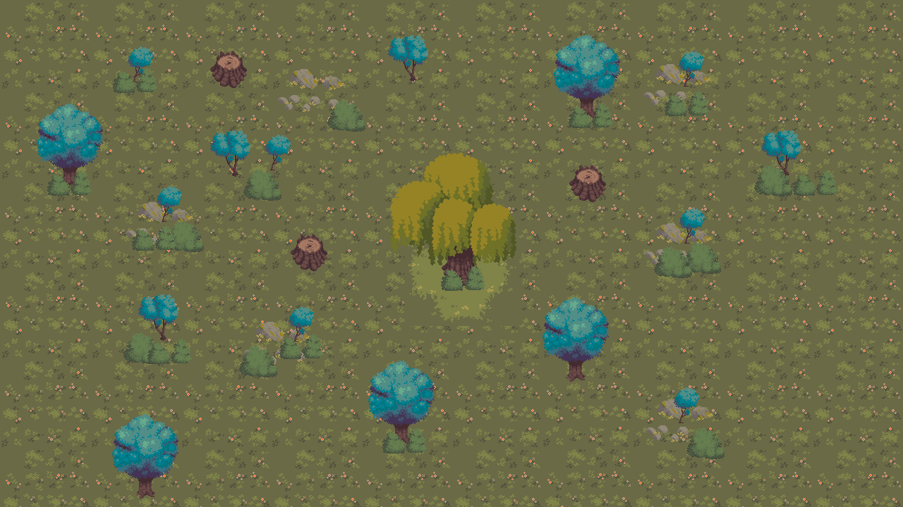

# 🏴‍☠️ Pirate Adventure

A fun pirate-themed adventure game project built using Python and Pygame.  
Explore the world, battle enemies, collect treasures, and experience a classic 2D adventure inspired by retro platformer games.

## 📌 About The Project

**Pirate Adventure** is a beginner-friendly game development project focused on creating an interactive pirate-themed experience with smooth gameplay mechanics, animated characters, and engaging level design.

This project was created for learning, experimentation, and improving game development skills using Python.

## 🎮 Features

- ⚔️ Player movement and combat system
- 🏴‍☠️ Pirate-themed characters and environment
- 👾 Enemy AI and interactions
- 💰 Collectibles and treasure mechanics
- 🎵 Sound effects and background music
- 🖼️ Sprite animations
- 🕹️ Retro-style 2D gameplay

## 🛠️ Built With

- Python
- Pygame

## 📂 Project Structure

```bash
Pirate_Adventure/
│
├── assets/          # Game assets (sprites, sounds, backgrounds)
├── levels/          # Level data and maps
├── main.py          # Main game file
├── player.py        # Player mechanics
├── enemy.py         # Enemy behaviors
├── settings.py      # Game settings/configuration
└── README.md
```

## 🚀 Getting Started

### Prerequisites

Make sure you have Python installed:

- Python 3.10 or newer
- Pygame library

Install Pygame using:

```bash
pip install pygame
```

## ▶️ Running The Game

Clone the repository:

```bash
git clone https://github.com/itsamecycy/Pirate_Adventure.git
```

Go to the project folder:

```bash
cd Pirate_Adventure/Pirate_Adventure
```

Run the game:

```bash
python main.py
```

## 🎯 Goals of This Project

- Practice game development using Python
- Learn object-oriented programming
- Explore animation and collision systems
- Experiment with enemy AI and gameplay mechanics

## 📸 Screenshots





## 📖 Future Improvements

- 🌎 More levels and maps
- ⚓ Boss fights
- 🏆 Save/load system
- 🧩 Quest system
- 🌊 Improved visual effects
- 🤝 Multiplayer support

## ⚠️ Disclaimer

This project is made for educational and experimental purposes only.

## 👤 Author

Created by:
[itsamecycy](https://github.com/itsamecycy)
[zensu-beans](https://github.com/zensu-beans)


## ⭐ Support

If you like this project, consider starring the repository on GitHub!


#ASSETS CAME FROM dsink485@gmail.com, mattz.pixel@gmail.com itch.io
